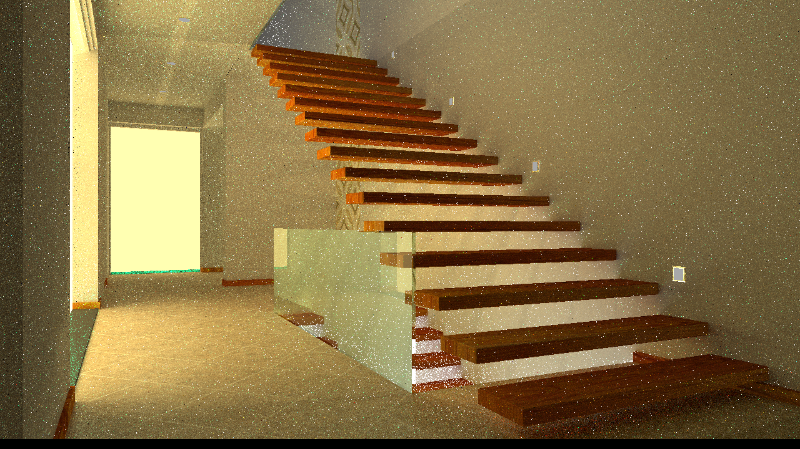

# Monte Carlo Path Tracer

## Features
- [x] BVH Acceleration
- [x] Multi-threading
- [x] Phong Model Importance Sampling
- [x] Next Event Estimation
- [x] Multiple Importance Sampling


## Results
### veach-mis 　*(method=MIS &nbsp; spp=1024 &nbsp; time~=20mins)*


### cornell-box  　*(method=NEE &nbsp; spp=16 &nbsp; time=~0.5h)*


### stairscase  　*(method=MIS &nbsp; spp=1024 &nbsp; time=~200mins)*


## Usage
```bash
mkdir build && cd build && make -j4 && ./PathTracing veach-mis 16 NEE
./PathTracing [arg1] [arg2] [arg3]
arg1: foldername in /models
arg2: samples per pixel AKA spp
arg3: different sampling method (options: NEE/BRDF/MIS)
```

## Environment
- OS: wsl2 ubuntu 20.04
- CPU: AMD Ryzen 7 5800H 3.20 GHz
- RAM: 16G DDR4 3200MHz
- IDE: Visual Studio Code & g++ & cmake
- Dependency Lib (all in **/libs**)：
    1. pugixml
        * parse xml file
    2. stb_image
        * load texture image  
        * write result image  
    3. tiny_obj_loader
        * load .obj & .mtl files 

## Code Description  

|filename|description|p.s.|
|:---:|:---:|:---:|
|main.cpp|Data process: parse files and args, set scene for rendering||
|Scene|Define **castRay(core function)**, store **objects** and **parameters** for render||
|Material|Define material's **property** and how to **sample**, __eval__, **calculate pdf** of the material||
|BVH|Build bvh and get intersection of bvh||
|Bounds3|Implement Axis-Aligned Bounding Box (AABB)||
|Renderer|Shoot rays, write results to PNG file||
|Object|Define base class Object, virtual method||
|Triangle|Define Class Mesh and Class Triangle|inherit from Object|
|Sphere|Define Class Sphere|inherit from Object|
|Light|Define base class Light||
|AreaLight|Define Class AreaLight|inherit from Light|
|Ray|Define ray's properties||
|Intersection|Define intersection's properties||
|Vector|Implement vector operation||
|global|Implement util functions||

## Link


